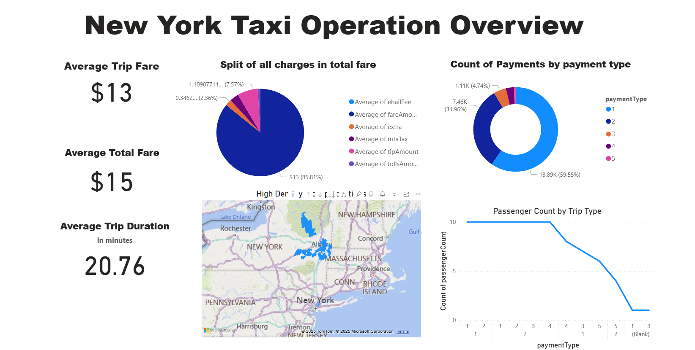

# NY Taxi Operation Overview Dashboard 🚖

## Dashboard Overview

This repository contains a comprehensive EDA notebook and Power BI dashboard for New York taxi rides.  
The project showcases data ingestion using Microsoft Fabric Lakehouse, data cleaning, transformation, and interactive visualizations.

---

## Table of Contents

1. [Project Overview](#project-overview)
2. [Dataset](#dataset)
3. [Technologies Used](#technologies-used)
4. [Data Pipeline](#data-pipeline)
5. [Exploratory Data Analysis](#exploratory-data-analysis)
6. [Power BI Dashboard](#power-bi-dashboard)
7. [Screenshots](#screenshots)
8. [Getting Started](#getting-started)
9. [Future Enhancements](#future-enhancements)
10. [Author](#author)

---

## Project Overview

The goal of this project is to analyze NY taxi ride data and provide insights through interactive dashboards.

**Key objectives:**
- Analyze trip volume, revenue, and distance trends
- Visualize pickup and drop-off hotspots
- Summarize KPIs like total trips, average fare, and duration
- Demonstrate data ingestion using Fabric Lakehouse

---

## Dataset

The data comes from Microsoft Fabric Lakehouse:

- **Table:** `taxi_rides`
- **Source:** Fabric OneLake
---

## Technologies Used

- Python (PySpark, Pandas, Matplotlib/Seaborn) for EDA
- Power BI for interactive dashboards
- Microsoft Fabric Lakehouse for data ingestion
- Git & GitHub for version control

---

## Data Pipeline

1. Data ingestion via Microsoft Fabric Lakehouse
2. Data cleaning and filtering (e.g., remove rows with NULL drop-off locations)
3. Creation of aggregated KPI tables:
   - Total fare, average distance & duration

---

## Exploratory Data Analysis

The EDA notebook (`EDA.ipynb`) includes:

- Distribution of trip distances and durations
- Correlation analysis between fare, distance, and duration

---

## Power BI Dashboard

The dashboard (`NY_taxi_dashboard.pbix`) includes:

- **KPI Cards:** average fare, total fare. average trip duration
- **Currency & formatting:** Revenue displayed in $

---


## Getting Started

### Prerequisites

- Python 3.x
- PySpark
- Power BI Desktop
- Git

### Installation

1. Clone the repository:

```bash
git clone https://github.com/msmmj/NY-taxi-Operation-Overview-Dashboard.git
cd NY-taxi-Operation-Overview-Dashboard
